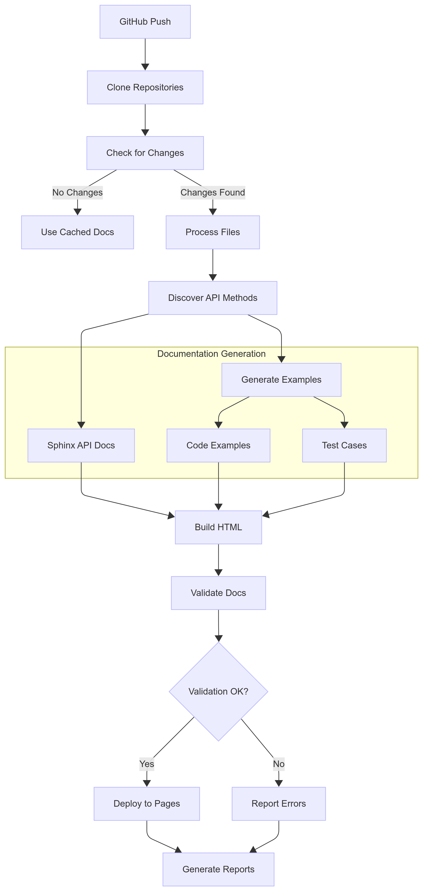
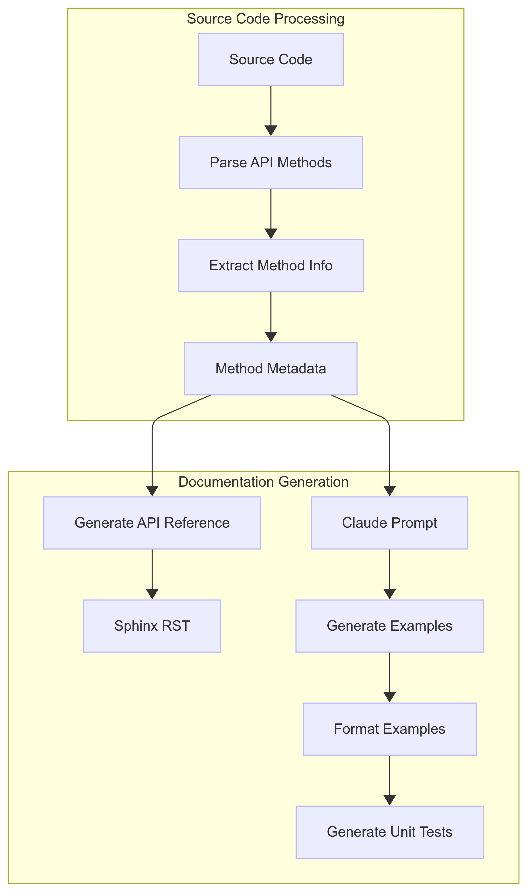
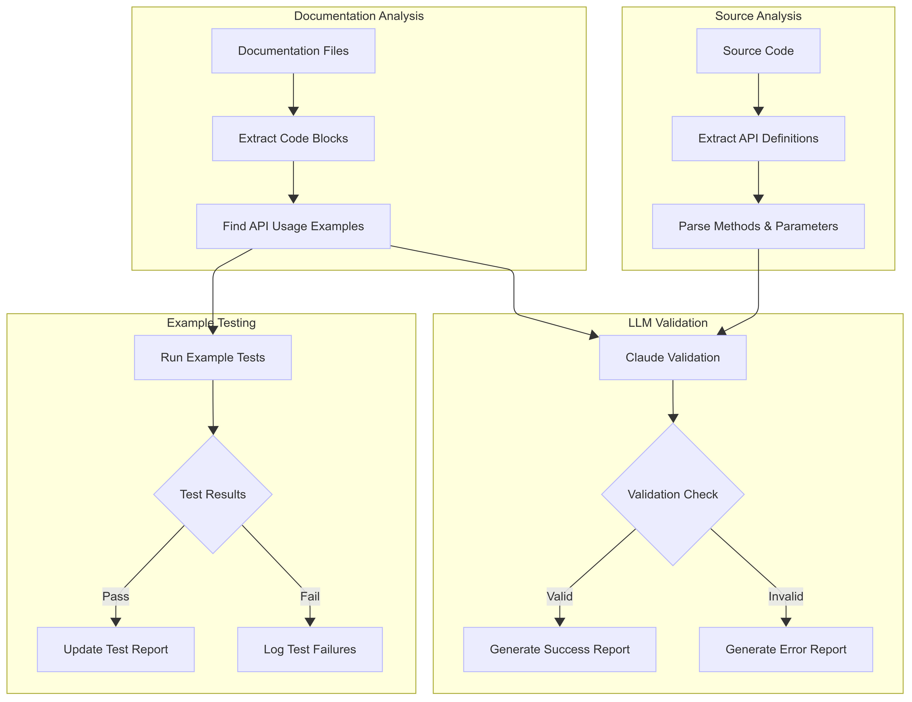

# LLM-Augmented Documentation CI/CD Pipeline

## Overview

This document details the architecture and implementation of a documentation CI/CD pipeline that uses LLMs to augment the documentation generation and validation process.

This pipeline is designed specifically to generate, validate, and publish developer documentation for Anthropic's Claude SDK for Python. The pipeline is designed to be used in a GitHub repository dedicated to documentation, and is triggered by a push to the repository.

**Note:** A pipeline for publishing documentation for Anthropic's Claude SDKs already exists. This pipeline architecture is not intended to replace that pipeline, but rather propose an alternative approach based on industry-standard practices.

## Architecture

### Overview

The four primary functions of the pipeline are as follows:

- **Documentation Generation**: This stage generates specific documentation from source code. This includes API reference documentation, code examples, and unit tests for the code examples.
- **Documentation Validation**: This stage validates the technical accuracy of documentation before it can be published. This includes validating the API reference documentation and example codes against the source code, and running unit tests on the example code.
- **Documentation Conversion**: This stage converts the documentation from its source code format (markdown) into a format that can be published to the web (HTML).
- **Documentation Deployment**: This stage publishes the documentation to the web.

These functions are implemented as separate steps in the pipeline, and are executed in order by a single build process.

Here is a high-level diagram of the pipeline:

### Main build process

The pipeline is implemented using a combination of python scripts and object-oriented data abstractions, GitHub Actions, and other third-party documentation tools (site generators, API documentation generators, etc.).

The GitHub workflow files that control the pipeline are in the `/.github/workflows` directory.

The main build script that runs the pipeline is defined in the `/build/build.py` file. This script extracts the API source code for the SDK from its repository and constructs object-oriented representations of the pipeline components. It then converts each API into a format that can be used to train the LLM for generation and validation.

### Documentation Generation

Not all documentation is generated from source code. In fact, most 
documentation is created by humans, increasingly with the help of LLMs.

Some documentation, specifically API reference documentation, can be generated directly and deterministically from source code. This practice guarantees that the documentation is accurate, and in a format that most developers expect. This pipeline leverages third-party tools to generate the API reference documentation from the source code, a standard practice in software documentation.

Example code, one of the most powerful features of good developer documentation, has historically been manually created. If the engineers who write the APIs for a given SDK write examples in the comments of the source code, you can use a third-party, static API generator to use those examples in the API reference documentation, along with class, method, and parameter descriptions. Otherwise, example code is manually created by engineers and technical writers and later published to developer documentation websites.

Using LLMs, you can also generate code examples that are tailored to each individual API, in addition to generating unit tests for the code examples. Although not necessarily deterministic, this practice guarantees that the code examples are accurate, relevant, and up-to-date. It also saves engineers and technical writers a lot of time, as they don't have to write the code examples and unit tests from scratch.

Here is a diagram of the documentation generation step:

#### Implementation Details

To generate documentation from source code, we will define several object-oriented representations of the individual APIs, examples, tests, and reference documentation. These files are defined in the `/utils` directory.

A third-party API documentation generator is used to generate the API documentation from the extracted source code. Which generator is used depends on the interface. As this implementation is limited to the Claude SDK for Python, the implementation in this repository uses [Sphinx](https://www.sphinx-doc.org/en/master/) to generate the API documentation from the extracted source code.

We construct LLM prompts to generate example code and unit tests for each API.

For more details about the generation implementation, see the `generate.py` and `example_generator.py`files.

### Documentation Validation

The validation step is another novel component of this pipeline, as it leverages LLMs to validate technical accuracy.

Ahead of prompting the LLM, the model must be trained on the API source code. This is done by extracting the API source code and converting it into a format that can be used to train the model.

After the model is trained, it is used to validate the documentation. The model is prompted to validate the documentation against the API source code. If the documentation does not accurately describe APIs, or if the example code does not properly demonstrate how to use the APIs, the LLM will return a list of errors and suggestions for how to fix them, preventing the documentation from being published during the validation step. 

The pipeline can use generated unit tests to validate example code is working as expected. This check can ensure that the example code is not only syntactically correct, but also functional.

Here is a diagram of the documentation validation step:

#### Implementation Details

The validation step is implemented in the `validate.py` file.

### Documentation Conversion

Documentation "source code" is written in markdown, a format that is not suitable for publishing to the web. The documentation conversion stage converts the documentation from its source code format into a format that can be published to the web (HTML). To convert documentation from markdown, restructured text, or other source code formats into HTML, we use the third-party static site generator [Jekyll](https://jekyllrb.com/).

### Documentation Deployment

The documentation deployment stage publishes the documentation to the web. We want to leverage a SaaS offering for this step, as designing a custom web deployment is outside the scope of this project. To deploy the documentation to the web, we use GitHub Pages, as it is the most popular and easiest to use service for this purpose.

